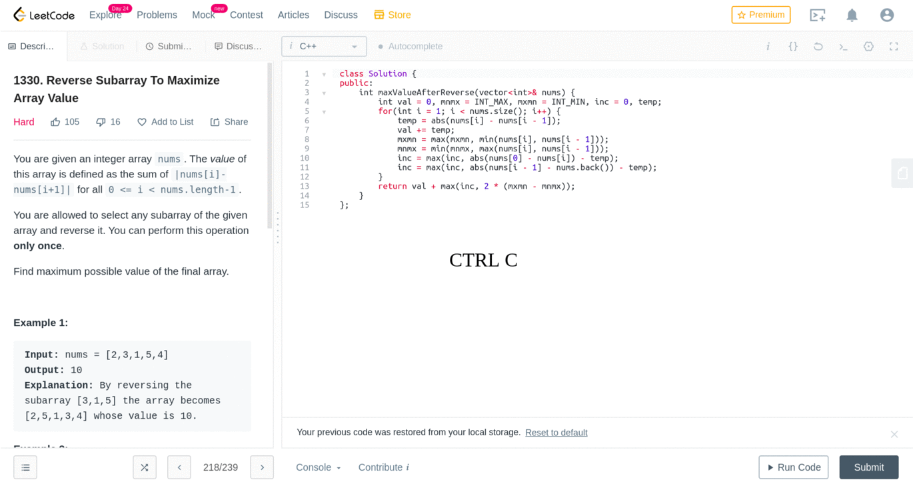

# leetcode-console-toggle
Keyboard shortcut to toggle your LeetCode console

#### Key Map
| Key          | Function       |
| ------------ | -------------- |
| `Ctrl` + `c` | Toggle console |
| `Ctrl` + `\` | Reset code     |
| `Ctrl` + `i` | Toggle notes   |

#### Install Instruction for Chrome
1. Go to the extensions tab
2. Check the developer mode
3. Download this repository, extract and load it as unpacked extension

#### Install Instruction for Firefox
1. Download this repository and extract the contents
2. Paste and go to URL `about:debugging#/runtime/this-firefox`
3. Click on Load Temporary Add-on
4. Select `manifest.json` from the extracted folder

#### Customization
1. Default shortcut is set to `CTRL + c`
2. You may change the configuration by modifying the following condition in `background.js`
   `event.ctrlKey && event.key === 'c'`
3. Reload the extension for the changes to take effect

### License
The MIT License (MIT) 2020 - Rohit Ner. Please have a look at the [LICENSE.md](LICENSE.md) for more details.